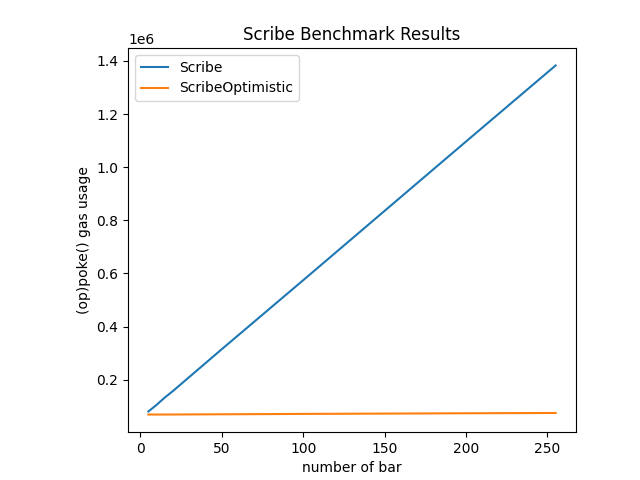

# Benchmarks

The benchmark for `Scribe` is based on the `poke()` function while the benchmark for `ScribeOptimistic` being based on the `opPoke()` function.

| `bar` | `Scribe::poke()`   | `ScribeOptimistic::opPoke()` |
|-------|--------------------|------------------------------|
|     5 |             79,769 |                       66,496 |
|    10 |            107,473 |                       66,556 |
|    15 |            132,715 |                       66,625 |
|    20 |            159,414 |                       66,685 |
|    50 |            318,426 |                       67,459 |
|   100 |            583,390 |                       68,879 |

The following visualization shows the gas usage for different numbers of `bar`:

For more info, see the `script/benchmarks/` directory.
