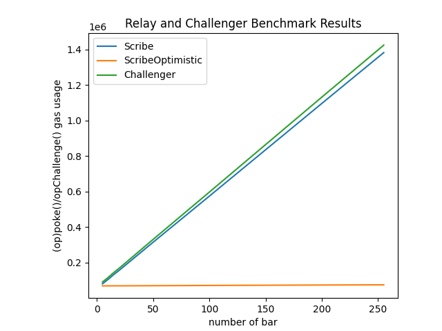

# Benchmarks

The benchmark for `Scribe` is based on the `poke()` function while the benchmark for `ScribeOptimistic` being based on the `opPoke()` function. The challenger's benchmark is based on the `opChallenge()` function.

| `bar` | `Scribe::poke()` | `ScribeOptimistic::opPoke()` | `ScribeOptimistic::opChallenge()` |
| ----- | ---------------- | ---------------------------- | --------------------------------- |
| 5     | 81,025           | 68,944                       | 90,374                            |
| 10    | 106,395          | 69,004                       | 115,745                           |
| 15    | 134,342          | 69,061                       | 143,701                           |
| 20    | 159,488          | 69,133                       | 168,848                           |
| 50    | 320,473          | 69,908                       | 330,371                           |
| 100   | 585,993          | 71,315                       | 596,972                           |
| 200   | 1,119,535        | 73,759                       | 1,132,141                         |
| 255   | 1,411,702        | 74,852                       | 1,424,857                         |

The following visualization shows the gas usage for different numbers of `bar`:

For more info, see the `script/benchmarks/` directory.
